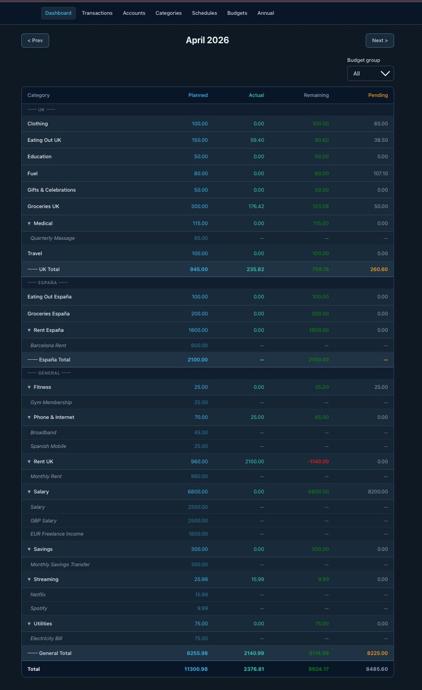
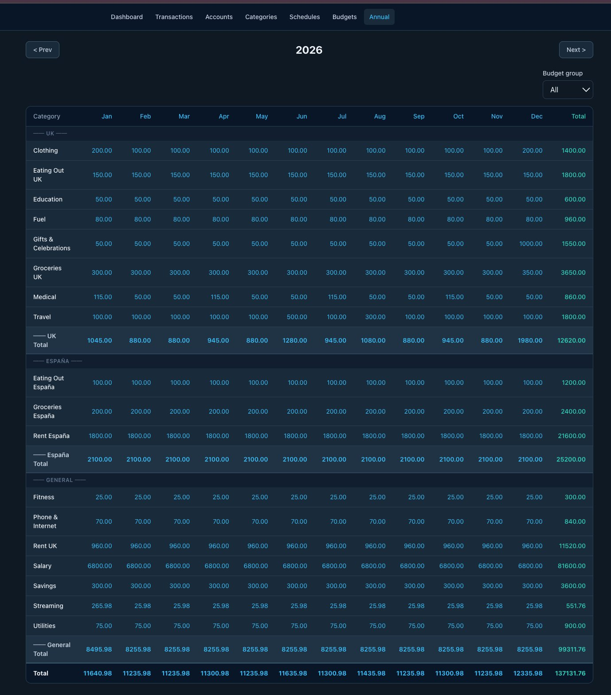
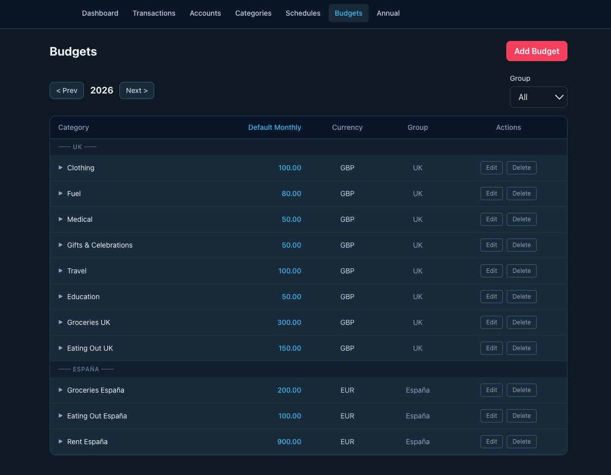
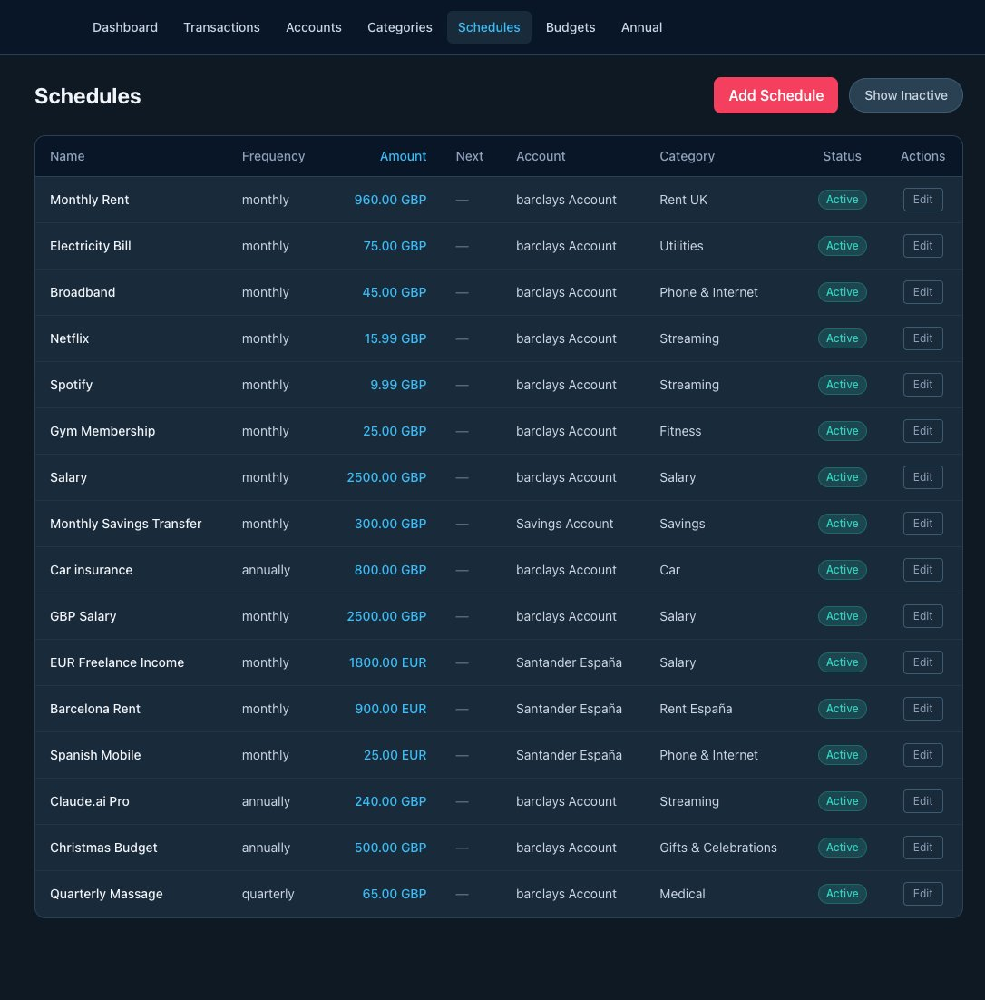
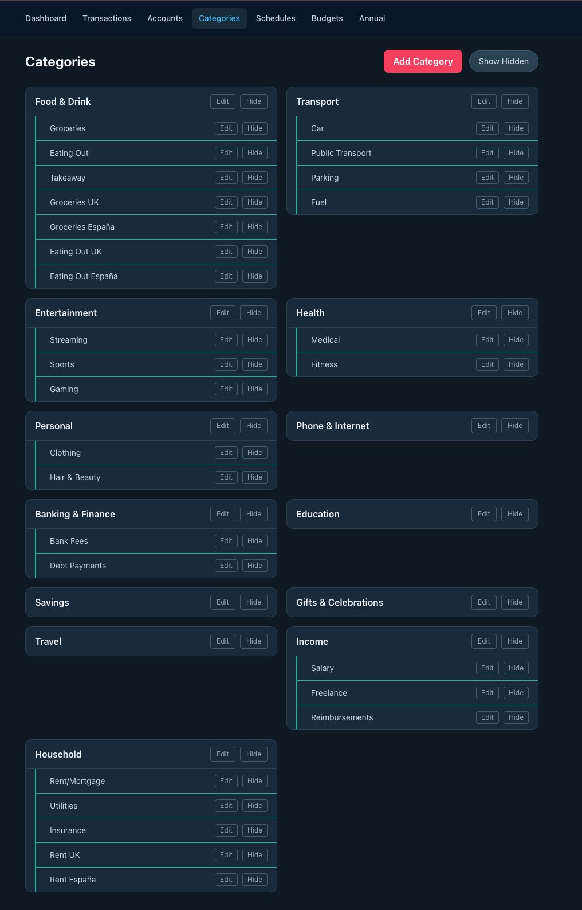
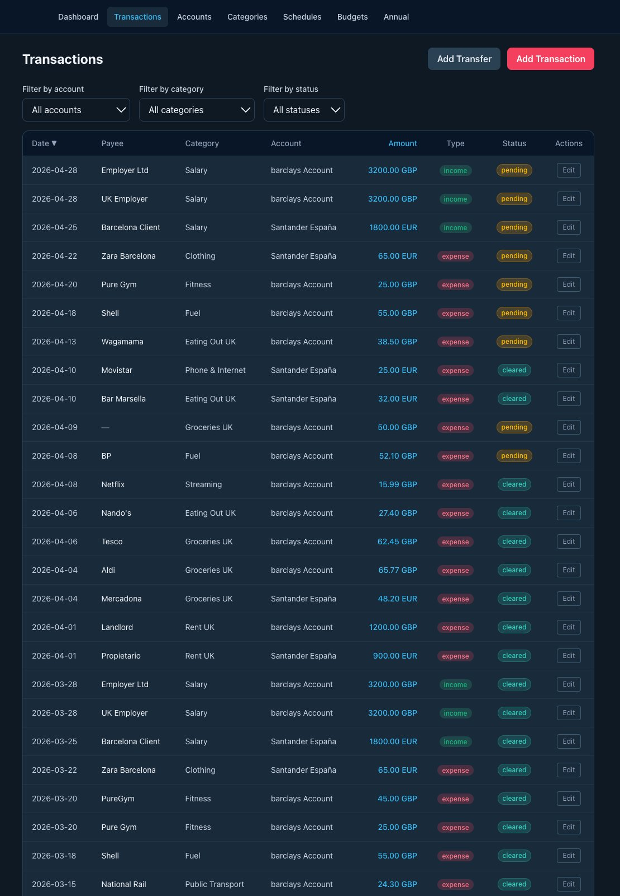
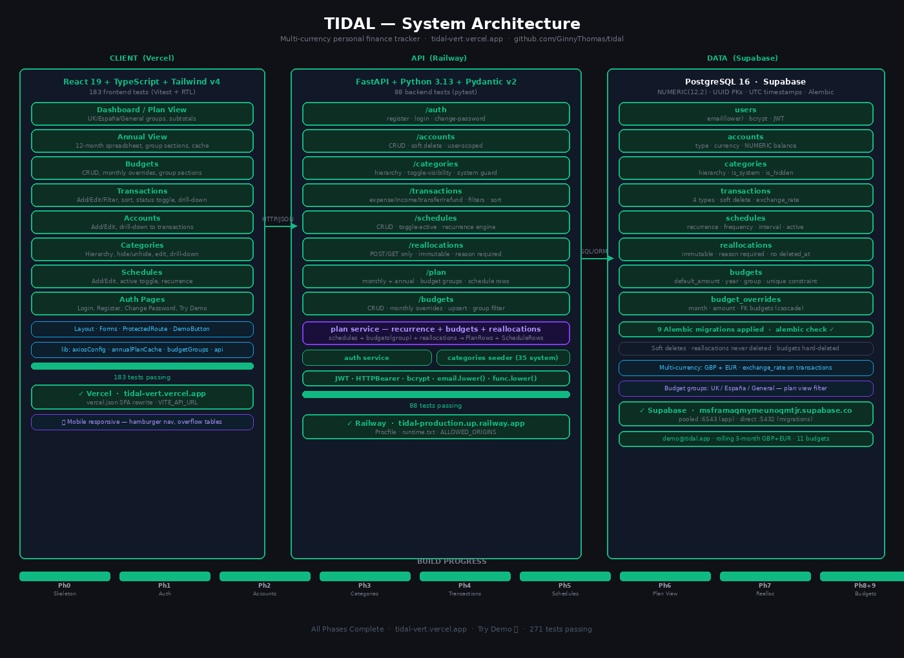

# Tidal 🌊

A multi-currency personal finance tracker that works like a living spreadsheet.

**Live demo:** [tidal-vert.vercel.app](https://tidal-vert.vercel.app) — click **Try Demo 🌊** (no signup needed)

---

## The Problem

Every finance app I tried had the same issue: pending transactions corrupt your budget view. You think you have £500 left for groceries, but half of it is already spent — it just hasn't cleared yet.

Tidal solves this by separating **planned** (what you expect to spend), **actual** (cleared/reconciled transactions), and **pending** (transactions that haven't cleared) — all visible in one screen.

---

## Screenshots

### Dashboard — Monthly Plan View
Budget groups (UK / España / General) with planned vs actual vs pending, group subtotals, and schedule breakdowns.



### Annual View
12-month spreadsheet replacing a budget spreadsheet. Group sections with monthly subtotals.



### Budgets
Set monthly spending targets per category with annual defaults and month-specific overrides.



### Schedules
Fixed recurring transactions — monthly, quarterly, annual — in GBP and EUR.



### Categories
Two-column hierarchy with regional variants (Groceries UK / Groceries España).



### Transactions
Multi-currency transactions with filters, sorting, and inline status toggle.



---

## Features

**Plan View**
- Monthly plan view: planned vs actual vs pending per category
- Annual view: 12-month spreadsheet with group sections and subtotals
- Budget groups (UK / España) for multi-currency household management
- Schedule breakdown: expand categories to see individual recurring items
- Reallocation tracking with immutable audit trail

**Budgets**
- Annual budgets with monthly defaults per category
- Month-specific overrides (e.g. £500 for groceries in December)
- Budget groups for UK/España/General separation
- Additive with schedules — both contribute to planned totals

**Transactions**
- Expense, income, transfer, refund types
- Pending / cleared / reconciled status with inline toggle
- Multi-currency (GBP, EUR) with per-transaction exchange rate
- Filter by account, category, status
- Sort by date, payee, category, account, amount, status
- Category drill-down from plan view

**Schedules**
- Monthly, quarterly, annual recurrence
- GBP and EUR schedules
- Active/inactive toggle
- Schedule amounts appear in plan view automatically

**Categories**
- Two-level hierarchy (parent + children)
- 35 system categories seeded on registration
- Custom categories (e.g. Groceries UK, Groceries España)
- Hide/unhide without deletion
- Drill-down to filtered transactions

**Accounts**
- Multiple accounts in multiple currencies
- Edit account details
- Drill-down to filtered transactions

**Auth**
- JWT authentication
- Register, login, change password
- One-click demo account

---

## Tech Stack

**Backend**
- Python 3.13 · FastAPI · PostgreSQL 16
- SQLAlchemy 2.x · Alembic · Pydantic v2
- pytest — 88 tests

**Frontend**
- React 19 · TypeScript · Vite
- React Router v7 · Tailwind CSS v4
- Vitest + React Testing Library — 183 tests

**Infrastructure**
- Backend: [Railway](https://railway.app)
- Frontend: [Vercel](https://vercel.com)
- Database: [Supabase](https://supabase.com) (PostgreSQL)

---

## Running Locally

```bash
# Clone
git clone https://github.com/GinnyThomas/tidal.git
cd tidal

# Backend
cd backend
python -m venv .venv
source .venv/bin/activate
pip install -r requirements.txt
cp .env.example .env  # add your DATABASE_URL
alembic upgrade head
uvicorn app.main:app --reload
# http://localhost:8000

# Frontend (new terminal)
cd frontend
npm install
cp .env.example .env  # set VITE_API_URL=http://localhost:8000
npm run dev
# http://localhost:5173
```

---

## Running Tests

```bash
# Backend
cd backend && python -m pytest tests/ -v

# Frontend
cd frontend && npm run test:run
```

---

## Demo Account

The live demo is pre-loaded with realistic data:
- **3 accounts**: Nationwide Current (GBP), Nationwide Savings (GBP), Santander España (EUR)
- **14 schedules**: monthly GBP + EUR, annual (Claude.ai Pro, Christmas), quarterly (Massage)
- **11 budgets**: UK group (GBP) and España group (EUR) with monthly overrides
- **Rolling transactions**: always covers the last 3 months + current month

To refresh demo data:
```bash
cd backend
./scripts/refresh_demo.sh
```

---

## Architecture



---

## Project Background

Built as a portfolio project to demonstrate full-stack engineering with Python and React, using TDD throughout and AI-assisted development (Claude as pair programmer, Copilot on every PR).

**271 tests · 9 phases · deployed to production**

The app solves a real problem I had — pending transactions corrupting budget views — and is now my actual personal finance tracker as I relocate from the UK to Barcelona in June 2026.

---

## Author

**Ginny Thomas** — Full Stack Engineer  
[github.com/GinnyThomas](https://github.com/GinnyThomas)  
Open to full-stack roles in Barcelona or remote from June 2026.
